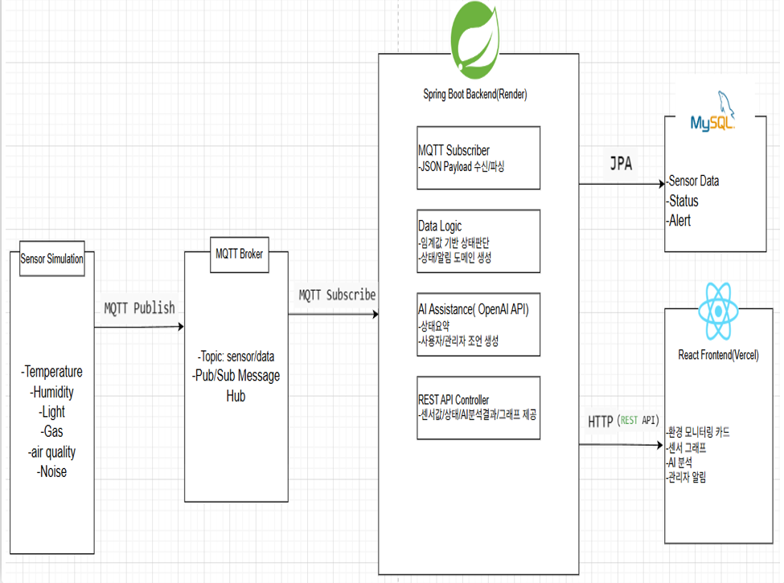

# 🏠 Smart Home System (1인 개발)

> 센서 데이터 시뮬레이션 + AI 환경 분석 기반 스마트 홈 모니터링 서비스

---

# 📑 목차

- [프로젝트 소개](#intro)
- [기술 스택](#stack)
- [주요 기능](#feature)
- [시스템 아키텍처](#arch)
- [핵심 구현 및 설계](#core)
- [서비스 화면](#ui)
- [트러블슈팅](#trouble)
- [회고](#review)

---

# 프로젝트 소개 

Smart Home System은 실내 환경 데이터를 기반으로 현재 공간 상태를 시각적으로 확인하고, 
AI 분석을 통해 사용자에게 관리 조언을 제공하는 서비스입니다.  

실제 센서가 없는 환경에서 동작하는
**시뮬레이터 기반 구조**로 설계했습니다.

---

# 기술 스택 

- Backend: Spring Boot, Spring Data JPA, OpenAI API
- Frontend: React
- Database: H2 / MySQL

---

# 주요 기능 

- 센서 데이터(온도, 습도, 조도, 가스, 소음, 공기질) 수집 및 제공
- 대시보드 기반 실시간 환경 상태 시각화
- AI 기반 환경 분석 및 사용자 맞춤 조언
- 센서 데이터 변화 그래프 제공 및 최대/최소값 출력
- 위험 수치 발생 시 관리자 알림 기능

---

# 시스템 아키텍처 

  

### 1. Sensor Simulation에서 온도, 습도, 조도 등의 센서 데이터를 생성
### 2. 생성된 데이터는 MQTT Publish 방식으로 Broker(HiveMQ)에 전송
### 3. MQTT Broker는 Pub/Sub 구조로 메시지를 관리하고 전달
### 4. Spring Boot 서버에서 MQTT Subscriber가 데이터를 수신
### 5. 수신된 데이터를 기반으로 환경 상태 분석 로직 수행
### 6. 분석 결과를 바탕으로 OpenAI API 호출 후 사용자 조언 생성
### 7. 처리된 데이터는 JPA를 통해 MySQL에 저장
### 8. REST API를 통해 프론트엔드에 센서 데이터 및 분석 결과 제공
### 9. React에서 데이터를 시각화하여 사용자에게 표시

---

# 핵심 구현 및 설계 

### 1. MQTT 기반 비동기 메시지 처리 구조 적용

- 센서 데이터의 실시간 처리를 위해 MQTT 프로토콜을 도입  
- HTTP 방식 대신 Pub/Sub 기반 비동기 메시지 처리 구조 설계  

**결과**
- 요청/응답 구조에서 벗어나 비동기 데이터 처리 가능  
- 실시간 센서 데이터 처리에 적합한 구조 확보  
- 시스템 간 결합도 감소 및 확장성 향상  

---

### 2. 데이터 시각화를 통한 사용자 경험 개선

- 기존 단순 센서값 나열 방식에서 사용자 이해도가 낮은 문제 존재  
- 사용자 UX 개선을 위해 그래프 기반 데이터 시각화 기능 도입  

**결과**
- 센서 데이터 변화 추이를 직관적으로 확인 가능  
- 사용자 경험(UX) 향상  
- 단순 데이터 제공 → 분석 가능한 정보 제공으로 확장  

---

### 3. OpenAI API 연동을 통한 자연어 기반 환경 분석

- 센서 데이터를 사용자에게 이해하기 쉬운 형태로 전달하기 위해 OpenAI API 연동  
- 분석 결과를 자연어 기반 조언 형태로 제공  

**결과**
- 사용자 친화적인 정보 전달 가능  
- 데이터 기반 서비스에서 AI 기반 서비스로 확장  
- 복잡한 센서 정보를 직관적인 설명으로 변환  

---

### 4. JPA(Hibernate) 기반 ORM 설계 및 데이터 계층 분리

- **문제**  
  직접 SQL 작성 시 코드 중복 및 유지보수 비용 증가  

- **해결**  
  - Spring Data JPA를 활용하여 Repository 계층 구성  
  - Hibernate를 통해 Entity ↔ Table 매핑 자동화  
  - Service / Repository 계층 분리를 통한 구조 개선  

- **결과**  
  - 반복적인 SQL 작성 제거  
  - 데이터 접근 로직 추상화로 유지보수성 향상  
  - 계층형 아키텍처 설계 경험 확보  

---

# 서비스 화면 

## 📊 대시보드

  

## 📈 그래프

  

## 🤖 AI 분석

  

## ⚠️ 알림

  

---

# 트러블슈팅 

### 1. 실시간 센서 데이터 처리 구조 한계 문제

- **문제**  
  초기에는 REST API 기반으로 센서 데이터를 전달하려 했으나,  
  요청마다 데이터를 처리하는 구조로 인해 실시간 처리에 한계 발생  

- **원인**  
  HTTP 기반 요청/응답 구조는 지속적인 데이터 스트림 처리에 비효율적  

- **해결**  
  MQTT Pub/Sub 구조를 도입하여 비동기 메시지 기반 데이터 처리 방식으로 전환  

- **결과**  
  - 실시간 센서 데이터 처리 가능  
  - 비동기 구조를 통한 시스템 확장성 확보  
  - 서비스 간 결합도 감소

---
### 2. 센서 데이터 흐름과 상태 처리 로직 혼합 문제

- **문제**  
  센서 데이터 수신, 상태 판단, AI 응답 생성 로직이 하나의 흐름에 섞여 있어 유지보수 어려움 발생  

- **원인**  
  데이터 처리와 비즈니스 로직이 분리되지 않은 구조  

- **해결**  
  - 센서 데이터 수신(MQTT Subscriber)  
  - 상태 분석 로직(Service Layer)  
  - AI 응답 생성(OpenAI API)  
  각 역할을 계층별로 분리  

- **결과**  
  - 책임 분리(SRP) 기반 구조 개선  
  - 유지보수성 및 코드 가독성 향상  
  - 기능 확장 시 영향 범위 최소화
---

# 회고 

단순한 센서 데이터 출력이 아닌, 데이터 생성 → 메시지 전달(MQTT) → 상태 분석 → 시각화 → AI 조언까지 
전체 데이터 흐름을 설계하며 시스템 구조를 고민할 수 있었다.  

특히 MQTT 기반 비동기 메시지 처리 구조를 적용하면서  
실시간 데이터 처리에 적합한 아키텍처와 서비스 간 결합도를 낮추는 설계의 중요성을 이해했다.  

또한 센서 데이터 처리, 상태 판단, AI 응답 생성을 계층별로 분리하며  
유지보수성과 확장성을 고려한 구조 설계 경험을 쌓을 수 있었다.  

이번 프로젝트를 통해 단순 기능 구현을 넘어 데이터 흐름, 비동기 처리, 시스템 설계까지 고려하게 되었고
단순 센서값 나열 프로그램에서 센서 데이터를 그래프 형태로 표현하고 사용자에게 직관적으로 전달하여 사용자UX향상을 고려한 개발을 하게 되었다.
