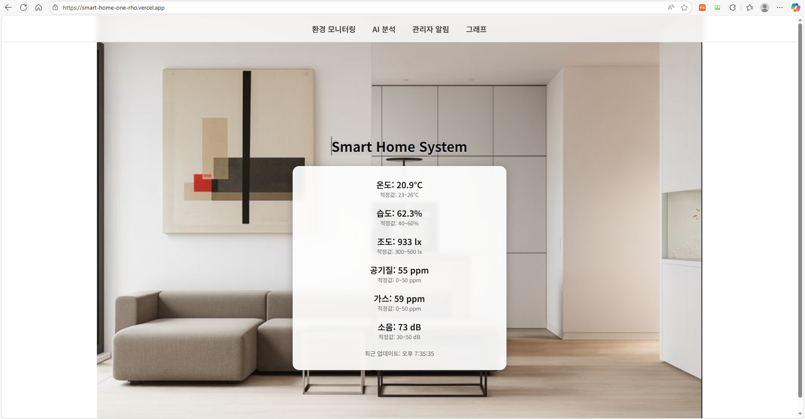
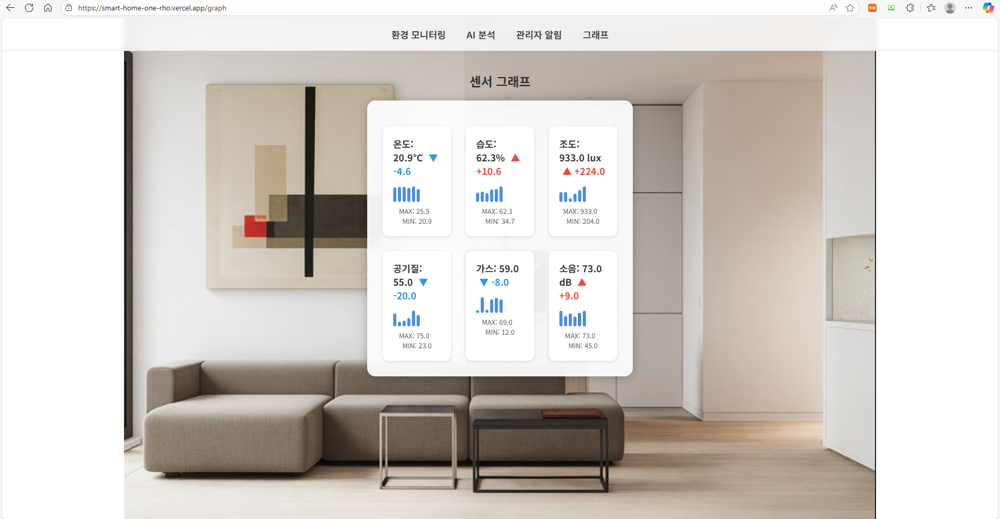
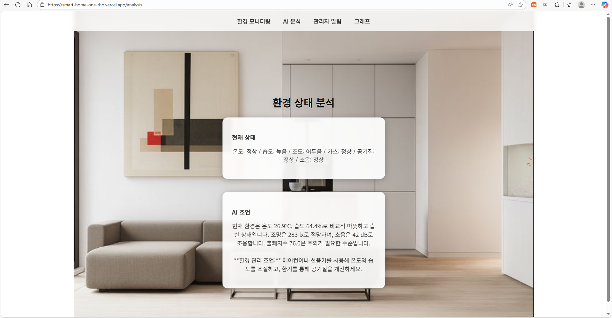
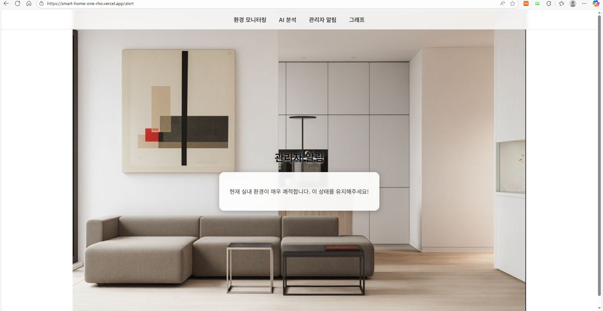

# 🏠 Smart Home System (1인 개발)

> 센서 데이터 시뮬레이션 + AI 환경 분석 기반 스마트 홈 모니터링 서비스

---

# 📑 목차

- [프로젝트 소개](#intro)
- [기술 스택](#stack)
- [주요 기능](#feature)
- [시스템 아키텍처](#arch)
- [핵심 구현 및 설계](#core)
- [서비스 화면](#ui)
- [트러블슈팅](#trouble)
- [회고](#review)

---

# 프로젝트 소개 

Smart Home System은 실내 환경 데이터를 기반으로 현재 공간 상태를 시각적으로 확인하고, 
AI 분석을 통해 사용자에게 관리 조언을 제공하는 서비스입니다.  

실제 센서가 없는 환경에서 동작하는
**시뮬레이터 기반 구조**로 설계했습니다.

---

# 기술 스택 

- Backend: Spring Boot, Spring Data JPA, OpenAI API
- Frontend: React
- Database: H2 / MySQL

---

# 주요 기능 

- 센서 데이터(온도, 습도, 조도, 가스, 소음, 공기질) 수집 및 제공
- 대시보드 기반 실시간 환경 상태 시각화
- AI 기반 환경 분석 및 사용자 맞춤 조언
- 센서 데이터 변화 그래프 제공 및 최대/최소값 출력
- 위험 수치 발생 시 관리자 알림 기능

---

# 시스템 아키텍처 

User → React Client
↓ REST API
Spring Boot
↓
Sensor Simulator (@Scheduled)
↓
Database / Memory

### 1. React → Spring Boot
프론트엔드에서 REST API를 통해 센서 데이터 요청  

### 2. Sensor Simulator
Spring Scheduler를 활용하여 주기적으로 센서 데이터 생성  

### 3. 데이터 처리
생성된 데이터를 저장 및 최신 상태 유지  

### 4. OpenAI API
환경 상태를 분석하여 사용자에게 조언 제공  

---

# 핵심 구현 및 설계 

### 1. 센서 시뮬레이터 기반 데이터 생성

- 실제 센서 환경이 없는 상황을 고려하여  
  Spring Boot 내부에 센서 시뮬레이터 구현 (@Scheduled)  

- 1분 주기로 랜덤 센서 데이터 생성  

**결과**
- 실제 하드웨어 없이도 서비스 동작 가능  
- 테스트 및 배포 환경에서 일관된 데이터 제공  

---

### 2. 환경 상태 분석 로직 설계

- 센서 데이터를 기준값과 비교하여 상태 분류  
- AI(OpenAI)는 판단이 아닌 설명 및 보조 역할로 활용  

**결과**
- 비즈니스 로직과 AI 역할 분리  
- 예측 가능한 시스템 구조 확보  

---

### 3. REST API 기반 데이터 흐름 설계

- `/sensor/latest` API를 통해 최신 데이터 제공  
- 모든 화면에서 동일한 데이터 소스를 참조하도록 설계  

**결과**
- 데이터 일관성 유지  
- 프론트엔드와 백엔드 간 결합도 감소  

---

### 4. JPA 기반 데이터 관리

- Spring Data JPA(Hibernate)를 활용한 ORM 구조 적용  
- 엔티티 기반 데이터 관리  

**결과**
- 반복적인 SQL 작성 감소  
- 유지보수성 향상  

---

# 서비스 화면 

## 📊 대시보드

  

## 📈 그래프

  

## 🤖 AI 분석

  

## ⚠️ 알림

  

---

# 트러블슈팅 

### 1. 센서 데이터 일관성 문제

- **문제**  
  여러 API 요청 시 서로 다른 시점의 데이터가 반환되어 화면 간 데이터 불일치 발생  

- **원인**  
  요청마다 새로운 데이터를 생성하는 구조  

- **해결**  
  최신 센서 데이터를 서버에 저장하고 모든 요청에서 동일 데이터 반환  

- **결과**  
  - 데이터 일관성 확보  
  - 사용자 혼란 감소  

---

### 2. Python 시뮬레이터 → Spring 내부 전환 문제

- **문제**  
  초기 Python 기반 시뮬레이터와 Spring 서버 간 통신 구조가 복잡  

- **원인**  
  별도 프로세스 운영으로 인한 구조 복잡성  

- **해결**  
  Spring Boot 내부 스케줄러로 통합  

- **결과**  
  - 시스템 구조 단순화  
  - 배포 및 관리 용이성 향상  

---

# 회고 

단순한 센서 데이터 출력이 아닌,  
데이터 생성 → 분석 → 시각화 → 조언까지의 흐름을 설계하며  
전체 시스템 구조를 고민할 수 있었다.  

특히 시뮬레이터를 내부로 통합하는 과정에서  
구조 단순화와 유지보수의 중요성을 경험했고,  
AI를 보조 도구로 활용하는 방식에 대해 이해할 수 있었다.  

이번 프로젝트를 통해  
단순 기능 구현을 넘어 데이터 흐름과 구조 설계의 중요성을 체감할 수 있었다.
